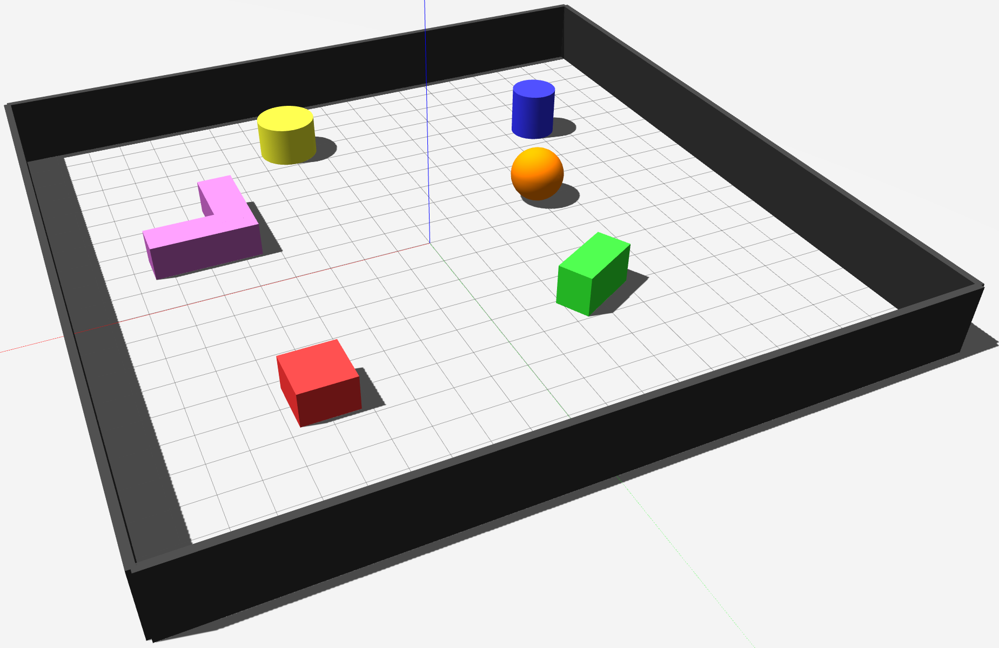
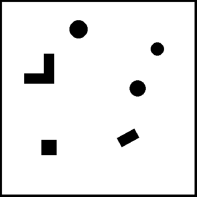

## sdf2pgm
Python Script fo Converterting `.world` to `.pgm` `.yaml` Map 

<div align="center">
  <table>
    <tr>
      <td><b>3D World in Gazebo</b></td>
      <td><b>Generated 2D Map</b></td>
    </tr>
    <tr>
      <td></td>
      <td></td>
    </tr>
  </table>
</div>

```{yaml}
image: obstacle_world.pgm
resolution: 0.05
origin: [-10.0, -10.0, 0.0]
occupied_thresh: 0.65
free_thresh: 0.196
negate: 0
```

## Usage
```
python3 sdf_to_pgm.py path/to/world.sdf
```
